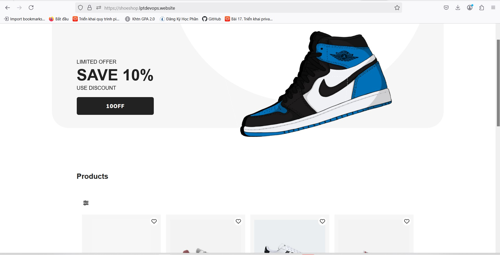
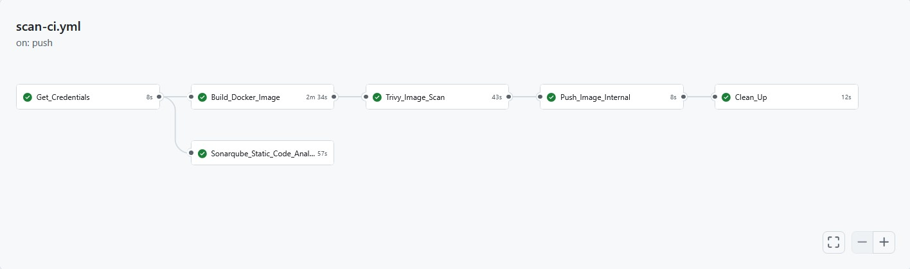
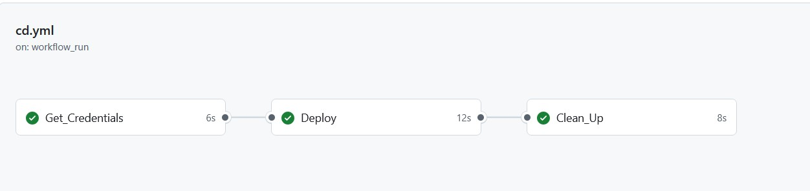

# Pipeline CI/CD cho Dự Án Shoeshop

Pipeline GitHub Actions này tự động hóa quá trình kiểm tra mã nguồn (Continuous Integration - CI) và triển khai ứng dụng (Continuous Deployment - CD) cho ứng dụng frontend `shoeshop_fe`. Pipeline này bao gồm hai phần chính:

1. **CI Pipeline**: Kiểm tra mã nguồn, xây dựng Docker image, quét mã nguồn và cơ sở hạ tầng.
2. **CD Pipeline**: Triển khai ứng dụng frontend lên môi trường sản xuất sau khi CI hoàn thành.

## Tổng Quan

### Workflow CI
Workflow CI chịu trách nhiệm kiểm tra mã nguồn và đảm bảo rằng ứng dụng không có lỗi. Sau khi kiểm tra thành công, Docker image mới sẽ được xây dựng và đẩy lên Docker registry.

Các bước trong CI:
1. **Check Code Quality**: Sử dụng công cụ quét mã nguồn để đảm bảo chất lượng.
2. **Build Docker Image**: Xây dựng Docker image cho frontend.
3. **Push Docker Image**: Đẩy Docker image lên Docker registry.
4. **Scan Image**: Quét cơ sở hạ tầng Docker để đảm bảo không có lỗ hổng bảo mật.

### Workflow CD
Sau khi CI hoàn thành, CD pipeline sẽ triển khai ứng dụng frontend lên môi trường sản xuất.

Các bước trong CD:
1. **Get Docker Credentials**: Lấy thông tin xác thực Docker từ Vault.
2. **Deploy Frontend**: Kéo Docker image mới và chạy container mới trên máy chủ.
3. **Clean Up**: Dọn dẹp Docker registry và đăng xuất sau khi triển khai thành công.

